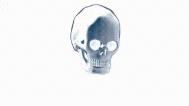

  

You can completely isolate the skull by setting the ColorBKG parameter to zero.

Have fun playing!

### Description of the Shader in Shadertoy:
Refactored the skull to be less taxing on the system and easier to read for modification. I also removed the plane
