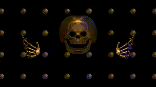

  

Unfortunately, this shader behaves a little differently than intended in OpenCL. For reasons I can't explain, the skull can't be mirrored properly.

Enjoy playing!

### Description of the Shader in Shadertoy:
Forked and Combined with another shader
https://www.shadertoy.com/view/wdjXzy

// All work and no play makes Jack a Dull Skull //
DULL SKULL - Playlist
https://www.shadertoy.com/playlist/c3sXWn
