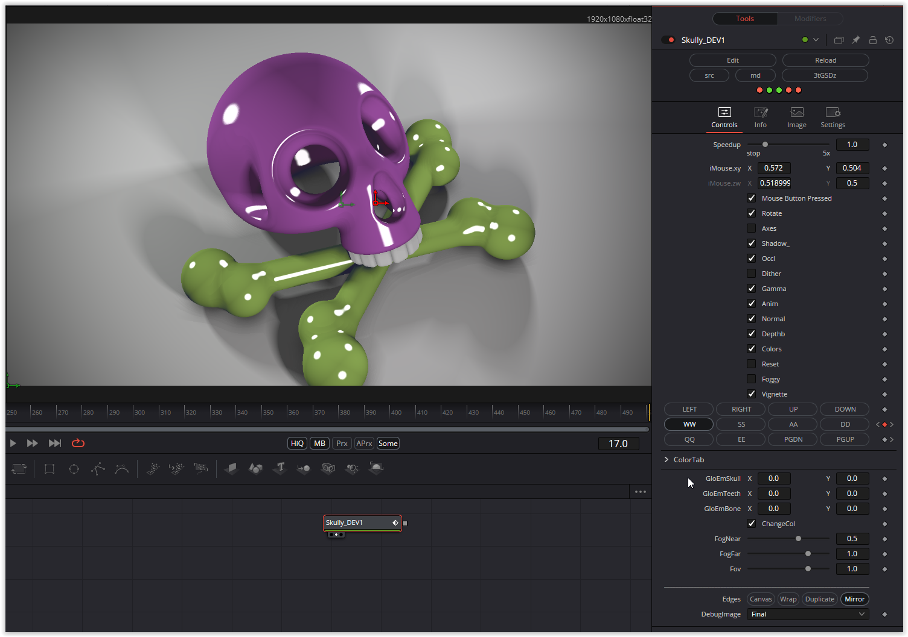

  

As you'd expect from monsterkodi, a really well-made shader. A somewhat unique programming style. The conversion was very time-consuming, but it was worth it.

First, it's important that the shader is either started at time position zero or that the "Reset" checkbox parameter is set and cleared once. This initializes the operating parameters in BufferA. The buttons (LEFT, RIGHT, ....) can be used to change the view of the shader.

The colors (skull, teeth, bone) are set slightly differently than usual.

The color parameter ColSkull, for example, is set as follows:
Red ....... Hue
Yellow... Saturation
Blue...... Lumination
Alpha.... Shiny
This then includes the GloEmSkull parameter:
GloEmSkull.x... Glossy
GloEmSkull.x... Emit

The color parameters for the teeth and bones are set accordingly.

Have fun playing

### Description of the Shader in Shadertoy:
I couldn't find neither teapot nor bunny :-)
