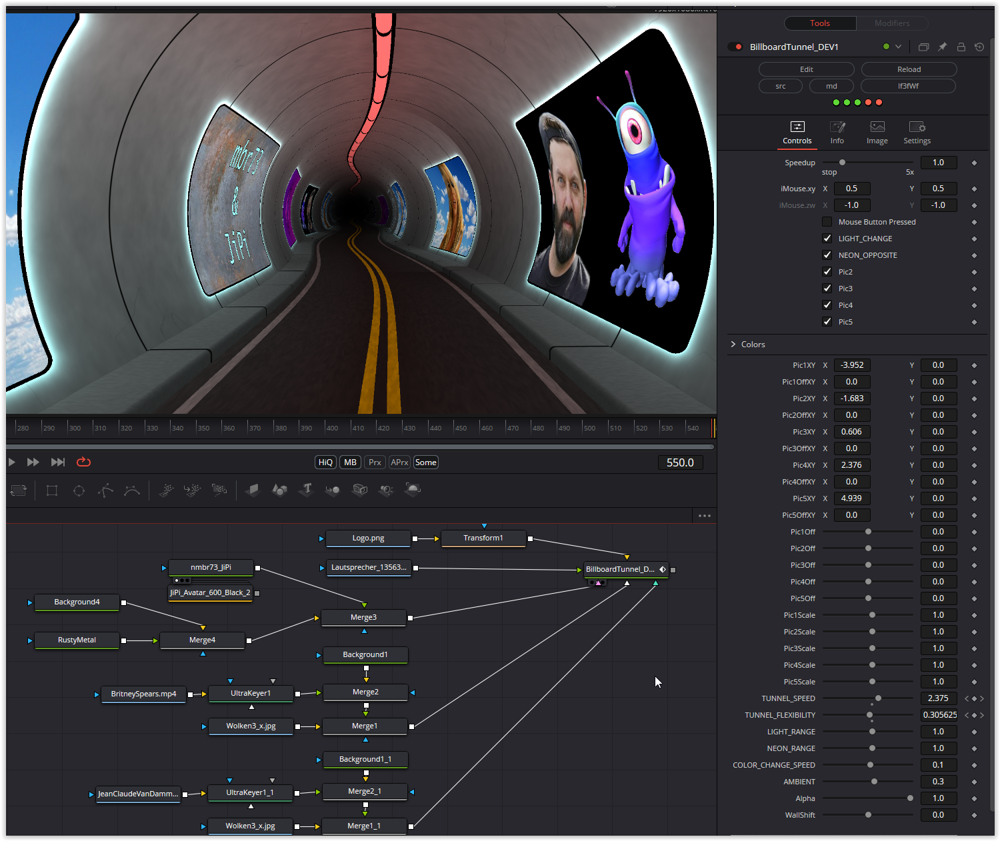

The current Shader Of The Week is not particularly interesting in my opinion, so I have translated a newer one from my favorite shadertoy author. In the original there is a "poster" in the tunnel. I have added four more, the position and size of which can be adjusted. The neon border can be changed and the speed and curve radii can be changed.

Have fun playing

