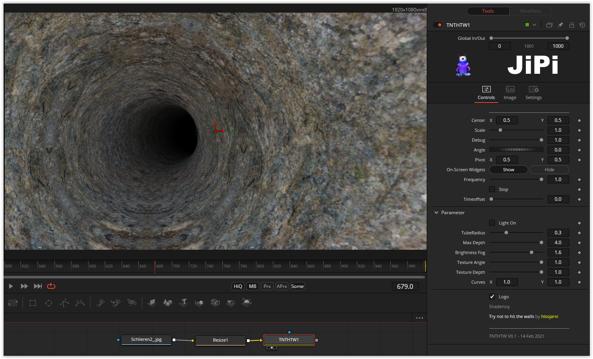

A Classic.

The classic among shaders. The ray marching algorithm is implemented with a while loop. So little code for so much effect. One of my first conversions, but I hadn’t built a fuse out of it yet.
The parameters of the fuse allow the tube radius, the rendering depth, the fog brightness, the curves and the texture to be changed.

Have fun playing
