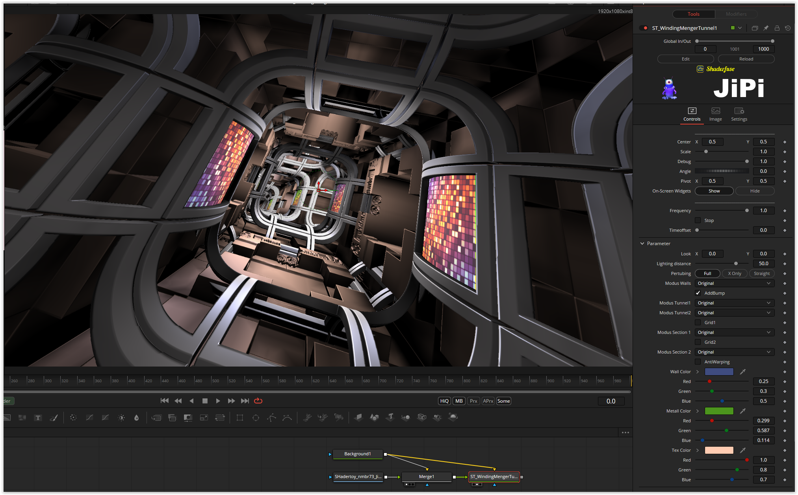

# WindingMengerTunnel.fuse :new:

Based on '_[WindingMengerTunnel](https://www.shadertoy.com/view/4scXzn)_' by [Shane](https://www.shadertoy.com/user/Shane) and ported by [JiPi](../../Site/Profiles/JiPi.md).

I had already tried a Menger shader without success. This time no error crept in and no incompatibilities occurred.
The individual objects are controlled by a global variable (objID). In order to get the shader to work under OpenCL, this variable would have to be looped through all functions. This is not implemented here, so that the fuse can "only" run under Cuda.

Here I came across a Mat3 addition for the first time and the function set had to be expanded:

```
__DEVICE__ inline mat3 mat3_add_mat3 (mat3 A, mat3 B) {
   mat3 C;

   C.r0 = to_float3 (A.r0.x + B.r0.x, A.r0.y + B.r0.y, A.r0.z + B.r0.z);
   C.r1 = to_float3 (A.r1.x + B.r1.x, A.r1.y + B.r1.y, A.r1.z + B.r1.z);
   C.r2 = to_float3 (A.r2.x + B.r2.x, A.r2.y + B.r2.y, A.r2.z + B.r2.z);

   return C;
   }
```
The shader still contains some gimmicks that are currently commented out and are there to be explored.

[](WindingMengerTunnel.fuse)


Have fun playing

## Compatibility
- [ ] Tested on macOS/Metal :bomb::bomb::bomb:
- [ ] Tested on macOS/OpenCL
- [x] Tested on Windows/Cuda
- [ ] Tested on Windows/OpenCL
