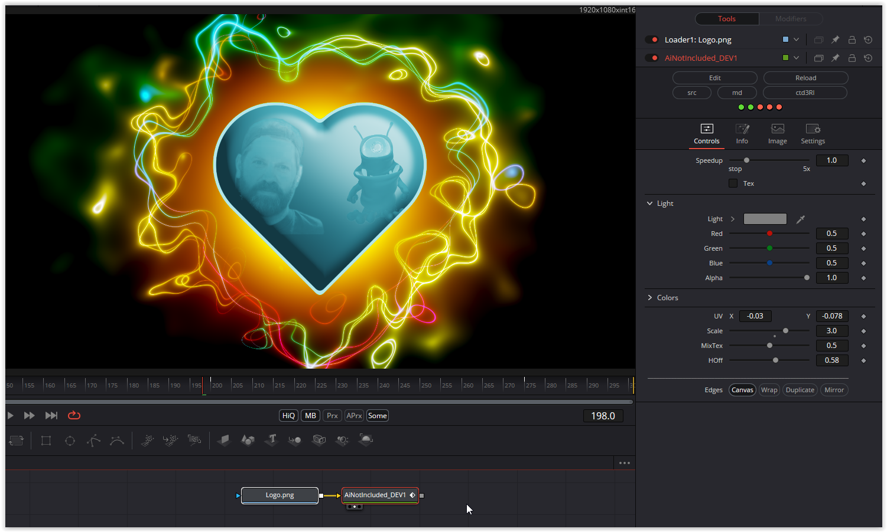

Would also have fit into the wedding category.
A texture can be loaded into the heart, either in the "original color" (check Tex) or the alienation of the shader. This can be regulated by Mix_Tex. Sacle and UV are used to align the texture in the heart.

Have fun

### Description of the Shader in Shadertoy:
CC0: AI not included
Tinkering around with old shaders.
No AI and very little human intelligence used ;)