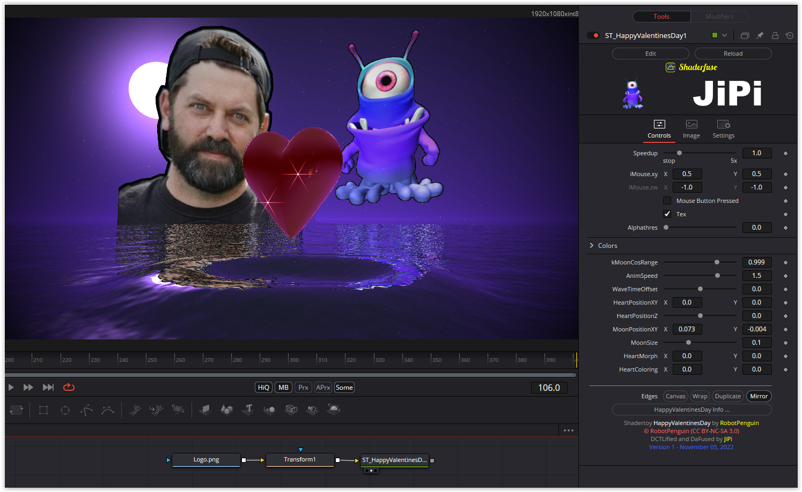

A beautiful scene for a wedding: the bridal couple is reflected in the water, in the background the moon, a heart rises from the depths, first black, but then red and sparkling.
The position of the moon can only be changed to a limited extent, constructing the scene in a sphere around the heart would have required a great deal of effort. The heart can be changed in color and position, but when you change the zoom, you come across the structure of the sphere again.

Have fun playing

