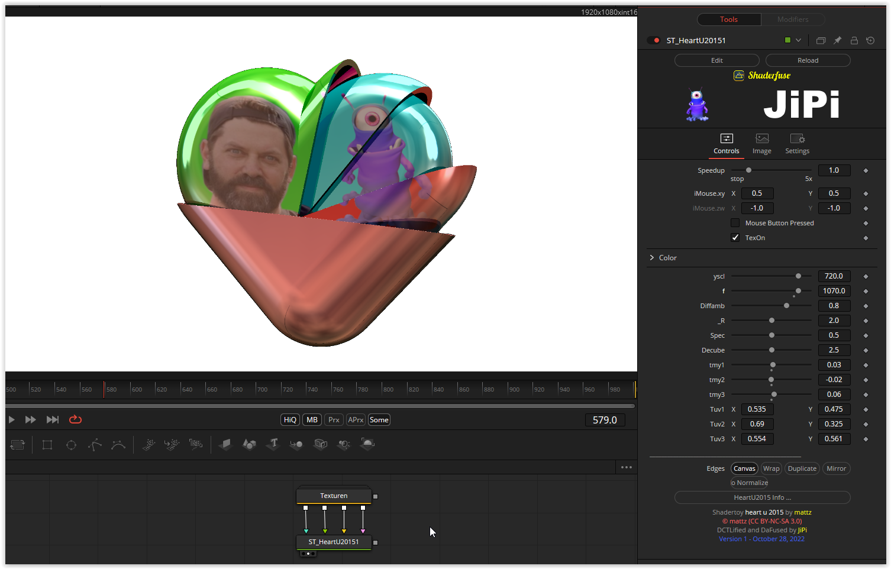

Nested partially open hearts that rotate around each other like clockwork.
The viewing angle can be changed using the mouse parameters.
The focus and a zoom can be adjusted with yscl and f.
Reflections (_R), Diffusion ( Diffamb) and Specular ( Spec ) are customizable, as is the strength of the cubemap (Decube). This is connected to iChannel0 and causes the mirroring.
With the help of the parameters tmy1, tmy2 and tmy3 the individual switches of the hearts can be selected for the setting with activated TexOn (inputs iChannel1 to IChannel3). The texture can then be moved to the correct position with the Tuv1, Tuv2 and Tuv3 respectively. The background color (Color) can be set and also become transparent. The Canvas setting under Edges is recommended for use with textures, otherwise the textures will be mirrored, expanded or continued at the edge.

Have fun playing

