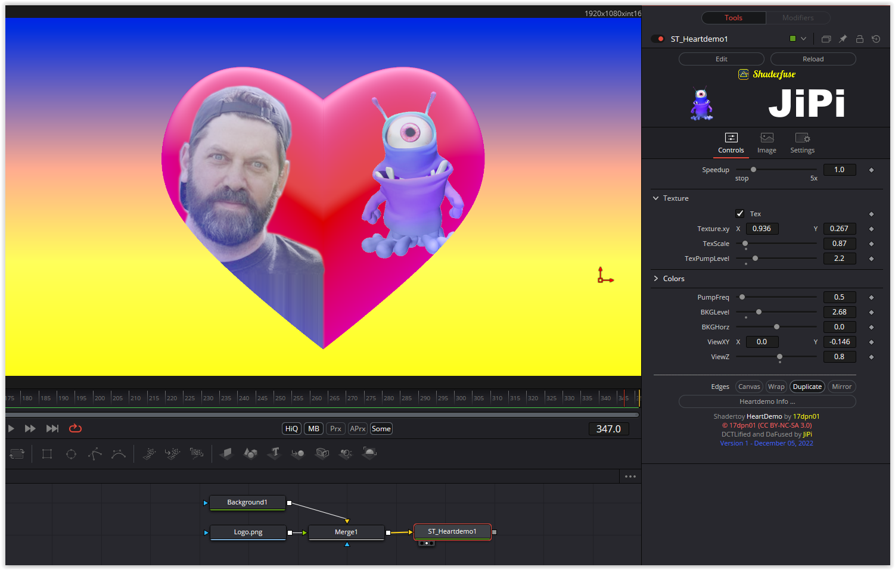

A pumping heart. With the button "Tex" a texture can be applied to the heart. This can be changed in size, position and pump stroke. All colors can be adjusted and the pumping frequency is also adjustable.

