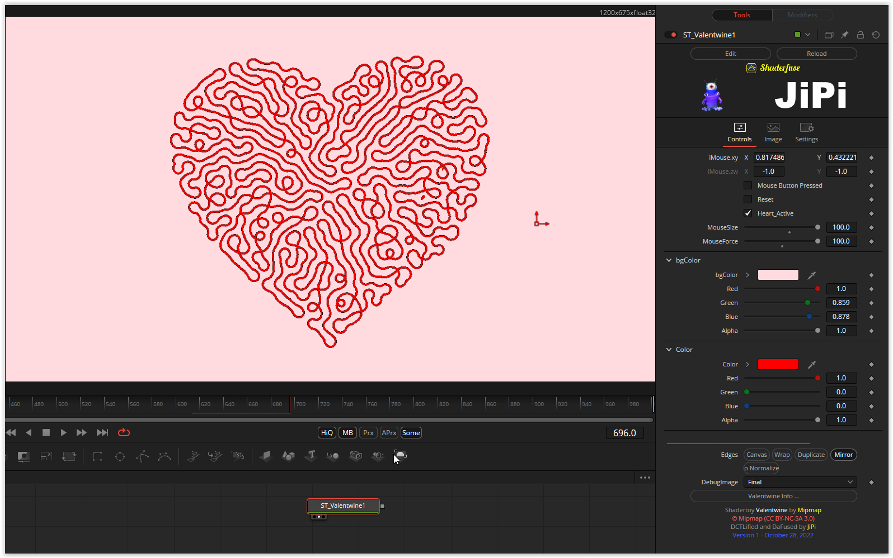

A heart is formed from a loose rope. When activating the "mouse button pressed", you can use the "iMouse.xy" parameters to bring movement into the shader, the area and the strength of the force applied to the rope can be varied (MouseSize, MouseForce), the rope color and background color can be changed and can also be made transparent.
Here it is important (as with all recursive shaders) that the shader is started from frame = 0. The "Reset" checkbox can be used to start in the timeline. If this is activated, the start values of the shader are set, if deactivated, the rendering process then starts.

Have fun playing

