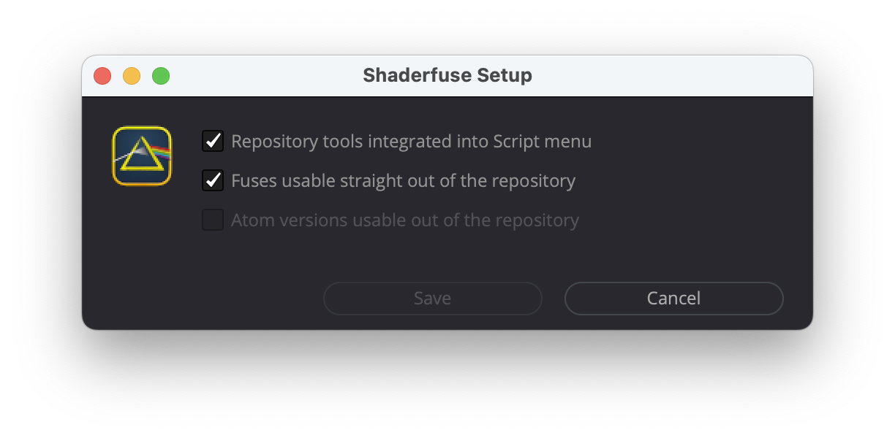

[README](../README.md)  | **Setup** | [Repository Tools](Scripts/Comp/Shaderfuse/Repository%20Tools/README.md)

# Tools

**WARNING!** All the stuff in `Tools/` is very fragile and to be handled with great care!


# Install

Drag'n'drop `Setup.lua`on your Fuison working area - and you are done or nuked. For details proceed reading ...


## Install via Setup-Script

* Drag and drop `Tools/Setup.lua` from your working copy on your DaFusions working area
* Check the 'Integrate the repository Tools into Script menu'  to - guess what - integrate the repository Tools into the Script menu



**IMPORTANT!** In particular if you are on Windows: don't forget to uncheck all options and to then save the configuration before moving or deleting your Shaderfuse working copy!

You can drag'n'drop `Tools/Setup.lua` whenever you want to change any of these options.


## Install Manually

You can ignore the following sections if you use the `Setup.lua` as described above. The following instruction might help if you want to do the installation manually, if you want to understand what the setup script does, or if you want to get things right again, if the `Setup.lua` messed up your system.


### Install 'Tools' manually by copying the files

Should work on macOS as well as on Windows (if you know where to find the corresponding DR and/or Fusion folders).

* Copy the folder `Shaderfuse` from `Shaderfuse/Tools/Scripts/Comp/`to your `Scripts/Comp/` folder.
* Copy the folder `Shaderfuse` from `Shaderfuse/Tools/Modules/Lua/`to your `Modules/Lua` folder.
* Create a file `Shaderfuse/~user_config.lua` in your `Modules/Lua/` folder.
* Edit that `~user_config.lua` file to contain the following text with `<PATHTOYOURREPO>` the path to your working copy of the repositoy:
```lua
local user_config = { pathToRepository = '<PATHTOYOURREPO>/' }
return user_config
```


### Install 'Tools' manually using Symlinks on a Mac

cd into your working copy ... in my case I cloned the repository into ‘~/Projects/':

```sh
cd ~/Projects/Shaderfuse/
````

Persist the information on where to find the repository ...
```sh
REPO=`pwd`

echo "local user_config = { pathToRepository = '$REPO/' }\nreturn user_config" \
 > $REPO/Tools/Modules/Lua/Shaderfuse/\~user_config.lua

BMD=~/Library/Application\ Support/Blackmagic\ Design
```

... and in the same shell set symbolic links for Fusion to point into your working copy:

```sh
cd "$BMD/Fusion/Modules/Lua"
ln -s "$REPO/Tools/Modules/Lua/Shaderfuse" Shaderfuse
cd "$BMD/Fusion/Scripts/Comp"
ln -s "$REPO/Tools/Scripts/Comp/Shaderfuse" Shaderfuse
```

... resp. do so for Resolve:
```sh
cd "$BMD/DaVinci Resolve/Fusion/Modules/Lua"
ln -s "$REPO/Tools/Modules/Lua/Shaderfuse" Shaderfuse
cd "$BMD/DaVinci Resolve/Fusion/Scripts/Comp"
ln -s "$REPO/Tools/Scripts/Comp/Shaderfuse" Shaderfuse
````


# Content

## Repository Tools

With `Setup.lua`'s *'Integrate the Repository tools into script menu'* option, the folder `Tools/Scripts/Comp/Shaderfuse/` is linked into DaFusions `Fusion/Scripts/Comp/` folder. Thereby all the scripts in `Tools/Scripts/Comp/Shaderfuse/` are accessible via the 'Workspace&#8594;Scrips&#8594;Shaderfuse' menu in DaVinci Resolve, resp. the 'Script&#8594;Shaderfuse' menu in Fusion.

Mainly these make up the 'Repository Tools' submenu items which are meant to perform one or the other action on your local copy of the repository. This being said: these *Repository Tools* are only of interest for you, if you actively work on the repository and the Fuse's source code.

See [Scripts/Comp/Shaderfuse/Repository Tools/](Scripts/Comp/Shaderfuse/Repository%20Tools/README.md) for further details.


## Documentation

Folder: [Documentation/](Documentation/) ... see [github.io/Shaderfuse/Documentation/](https://nmbr73.github.io/Shaderfuse/Documentation/)

...


## Modules

Folder: [Modules/Lua/Shaderfuse/](Modules/Lua/Shaderfuse/)

...
