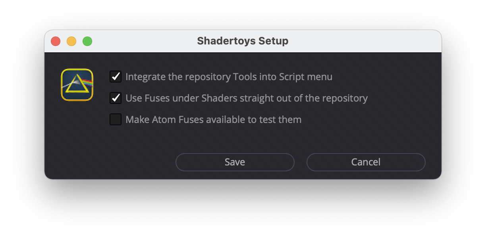

# Tools


**WARNING!** All the stuff in `Tools/` is very fragile and to be handled with great care!

# Install

Drag'n'drop `Setup.lua`on your Fuison working area - and you are done or nuked. For details proceed reading ...
## Install via Setup-Script

* Drag and drop `Tools/Setup.lua` from your working copy on your DaFusions working area
* Check the 'Integrate the repository Tools into Script menu'  to - guess what - integrate the repository Tools into the Script menu



**IMPORTANT!** In particular if you are on Windows: don't forget to uncheck all options and to the save the configuration before moving or deleting your Shadertoys working copy!

## Install Manually

You can ignore the following sections if you use the `Setup.lua` as described under 'Install'. The following instruction might help if you want to do the installation manually, if you want to understand what the setup script does, or if you want to get things right again, if the `Setup.lua`messed up your system.

### Install 'Tools' manually by copying the files

Should work on macOS as well as on Windows (if you know where to find the corresponding DR and/or Fusion folders).

* Copy the folder `Shadertoys` from `Shadertoys/Tools/Scripts/Comp/`to your `Scripts/Comp/` folder.
* Copy the folder `Shadertoys` from `Shadertoys/Tools/Modules/Lua/`to your `Modules/Lua` folder.<br />
* Create a file `Shadertoys/~user_config.lua` in your `Modules/Lua/` folder.<br />
* Edit that `~user_config.lua` file to contain the following text with `<PATHTOYOURREPO>`the path to your working copy of the repositoy:
```lua
local user_config = { pathToRepository = '<PATHTOYOURREPO>/' }
return user_config
```


### Install 'Tools' manually using Symlinks on a Mac

cd into your working copy ... in my case I cloned the repository into ‘~/Projects/':

```
cd ~/Projects/Shadertoys/
````

Persist the information on where to find the repository ...
```
REPO=`pwd`

echo "local user_config = { pathToRepository = '$REPO/' }\nreturn user_config" \
 > $REPO/Tools/Modules/Lua/Shadertoys/\~user_config.lua

BMD=~/Library/Application\ Support/Blackmagic\ Design
```

... and in the same shell set symbolic links for Fusion to point into your working copy:

```
cd "$BMD/Fusion/Modules/Lua"
ln -s "$REPO/Tools/Modules/Lua/Shadertoys" Shadertoys
cd "$BMD/Fusion/Scripts/Comp"
ln -s "$REPO/Tools/Scripts/Comp/Shadertoys" Shadertoys
````

... resp. do so for Resolve:
```
cd "$BMD/DaVinci Resolve/Fusion/Modules/Lua"
ln -s "$REPO/Tools/Modules/Lua/Shadertoys" Shadertoys
cd "$BMD/DaVinci Resolve/Fusion/Scripts/Comp"
ln -s "$REPO/Tools/Scripts/Comp/Shadertoys" Shadertoys
````


# Repo Tools

With `Setup.lua`'s *'Integrate the Repository tools into script menu'* option, the folder `Tools/Scripts/Comp/Shadertoys/` is linked into DaFusions `Fusion/Scripts/Comp/` folder. Thereby all the scripts in `Tools/Scripts/Comp/Shadertoys/` are accessible via the 'Workspace&#8594;Scrips&#8594;Shadertoys' menu in DaVinci Resolve, resp. the 'Script&#8594;Shadertoys' menu in Fusion.

Mainly these make up the 'Rep Tools' submenu which are meant to perform one or the other action on the repository. This being said: these *Repo Tools* are only of interest for you, if you actively work on the repository and the Fuse's source code.

## Create a single - Fat Boy - Installer containing all Fuses

DOES NOT WORK YET! DOES NOTHING FOR THE TIME BEING!

## Create a multiple Installers - one Installer per Fuse

DOES NOT WORK YET! DOES NOTHING FOR THE TIME BEING!

## Refresh the Fuse overview MarkDown files

...

## Update Fuses with current Boilerplate Code

Goes through all Fuses under `Shaders/` and replaces the FUREGISTERCLASS and the SHADERFUSECONTROLS code with the code blocks found in `Tools/Snippets/FUREGISTERCLASS.development.lua` resp. `Tools/Snippets/SHADERFUSECONTROLS.development.lua`. Do do so it searches for some magic "SCHNIPP"/"SCHNAPP" markers - it's important that the code snippets themself again include these markers so that the action can be redone (in the particular case of the `*.reactor.lua` code replacement these markers don't have to be maintained as the generation of the atom package is alway performed on the source Fuses but not repeated on the target files).

**TODO:** This menu item has no user interface yet. It would be nice to show a yes/no dialog explaining the functionality and to show the results in an info dialog afterwards (currently you have to look into the console window to see if something happened).

## Write Atom and compile Fuses for publication on Reactor

This copies all Fuses from `Shaders/` to the `Atom/com.JiPi.Shadertoys/Fuses/Shadertoys_wsl/` folder. Target filenames are the original Fuses' Shadertoy.com IDs to avoid any issues for the end user who installed the shaders via Reactor in case a Fuse file is renamed or moved within the repository. In each Fuse the FU register code and the code for the Fuse's Inspector controls is replaced by the respective `Tools/SNippets/*.reactor.lua` snipped (see the 'Snippets' section in this document for further information on this). After executing this script via the DaFusions script menu, the `Atom` folder should be ready to be zipped and shipped as a Reactor publication suggestion in the WSL forum (which is in general done by [JiPi](../Site/Profiles/JiPi.md)).


# Snippets

Each Fuse contains a block of code to register the component with DaFusion - this block determines the Fuse's name, it shows an edit and a reload button for development purposes, etc. The `Tools/Snippets/FUREGISTERCLASS.development.lua` file contains that code block for all the Fuses under `Shaders/`. The `Tools/Snippets/FUREGISTERCLASS.reactor.lua` contains that exact block for Fuses that are supposed to be published to the WSL Reactor.

Each Fuse contains some information that is displayed in the Inspector. That is e.g., a link to the webpage containing further information, the original name and author, etc. The `Tools/Snippets/SHADERFUSECONTROLS.*.lua` files contain the respective code block variants for the Fuses in the repository (`Shaders/`) as `*.development.lua` and those in case the Fuses are bundled for Reactor (`Atom/`) as `*.reactor.lua`.

Calling the 'Update Fuses with current Boilerplate Code' menu item in the 'Repo Tools' submenu scans all Fuses under `Shaders/`and replaces the respective code blocks with those from the `*.development.lua` snippet files.

When generating the Reactor package by calling 'Write Atom and compile Fuses for publication on Reactor' the script uses the `*.reactor.lua` snippets when writing the Fuses into the `Atom/` folder.

Long story short: this way we have some consistent registration and information for each Fuse that, if needed, can be changed for all Fuses by simply editing the corresponding 'snippets'.