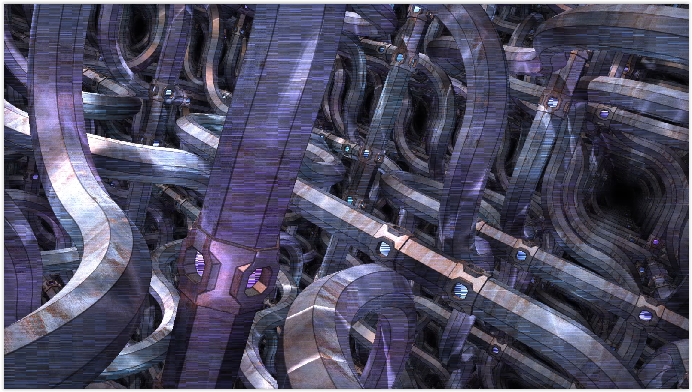
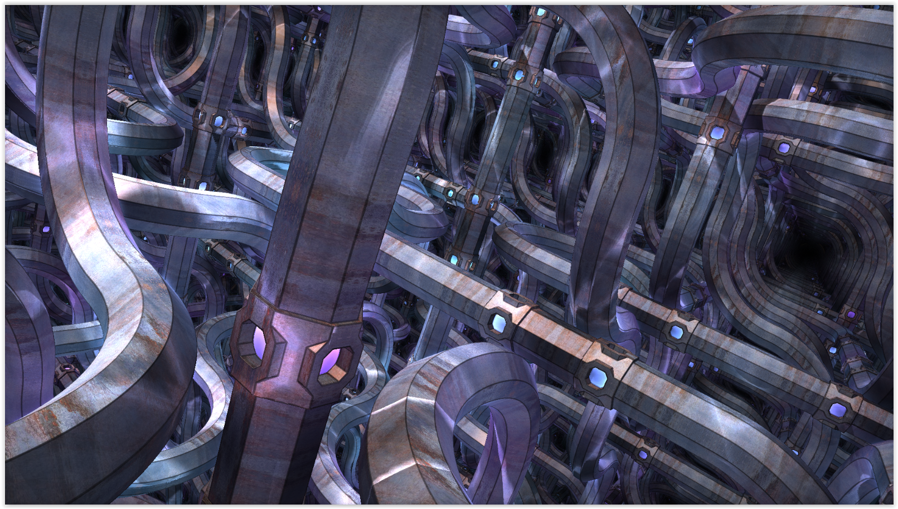

Dual3DTruchetTiles
==================

Based on '_[Dual3DTruchetTiles](https://www.shadertoy.com/view/4l2cD3)_' by [Shane](https://www.shadertoy.com/user/Shane) and ported by ported by [JiPi](../../Site/Profiles/JiPi.md).

Again a great flight shader. After the translation into Cuda-DCTL, the typical horizontal artifacts emerged. Here with this shader completely evenly, but across the whole board.

Resolving the global variables also solves this problem.

